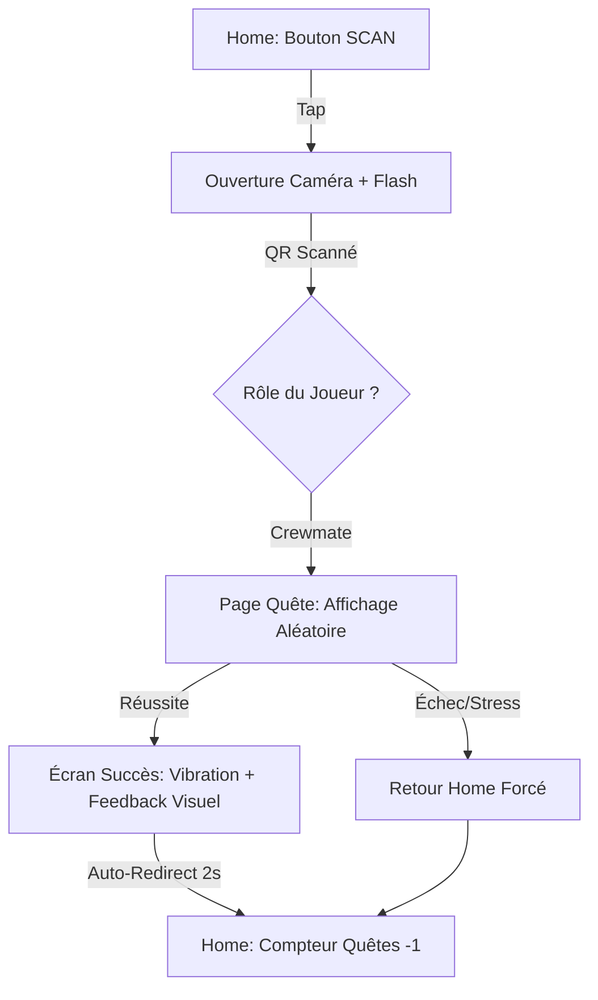
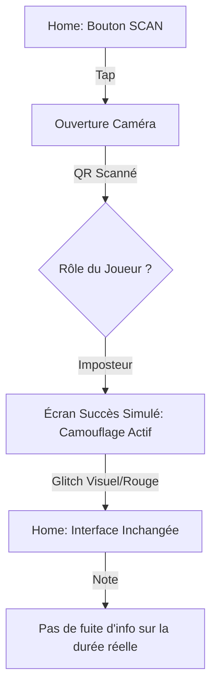
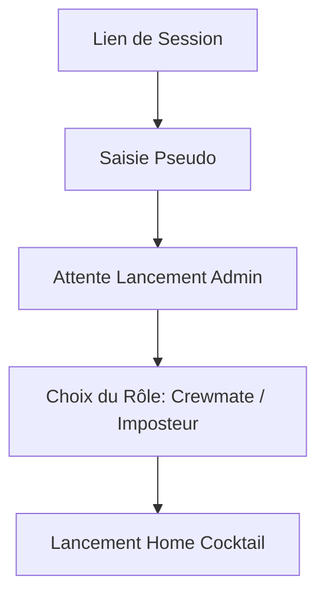

# UX Design Specification amogus

**Author:** Omi
**Date:** 2026-02-03

---

<!-- UX design content will be appended sequentially through collaborative workflow steps -->

## Executive Summary

### Project Vision

Amogus est une application "compagnon" mobile-first conçue pour orchestrer des parties d'Among Us IRL. L'objectif UX est de minimiser le temps passé sur l'écran pour maximiser l'immersion dans le jeu physique. L'application doit être un outil invisible : extrêmement simple, rapide et fiable, capable de fonctionner sous le stress d'une partie.

### Target Users

- **Organisateurs :** Ont besoin d'un outil de configuration ultra-rapide et d'une vue d'ensemble claire pour superviser la partie.
- **Crewmates :** Recherchent une expérience de quête intuitive et une boucle de validation instantanée pour retourner à leur surveillance IRL.
- **Imposteurs :** Nécessitent une interface de camouflage qui imite le flux des crewmates sans révéler d'informations sensibles.

### Key Design Challenges

- **Conception pour le stress :** L'interface doit être utilisable avec une attention divisée. Les boutons doivent être larges, les textes courts et les feedbacks visuels explicites.
- **Flux de camouflage (Imposteur) :** Créer un écran de succès "générique" qui permet à l'imposteur de simuler une quête sans paraître suspect ni obtenir d'indices sur la quête réelle.
- **Usage en mouvement :** L'ergonomie doit être pensée pour une utilisation à une main, avec des éléments interactifs facilement accessibles au pouce.

### Design Opportunities

- **Fluidité par l'animation :** Intégrer des micro-animations ultra-rapides pour fluidifier les transitions et confirmer les actions sans ralentir l'utilisateur.
- **Identité visuelle forte :** Utiliser un design sombre (Dark Mode par défaut) avec des accents néon/vibrants pour assurer un contraste élevé et une esthétique "Cyber/Espace" premium.

## Core User Experience

### Defining Experience

L'expérience centrale repose sur la boucle "Scan → Action → Succès". Le produit doit agir comme un outil tactique de terrain : invisible quand il n'est pas utilisé, et instantanément efficace lors de l'interaction. La résolution d'une quête est l'apogée émotionnelle de la boucle numérique, validant les efforts physiques du joueur.

### Platform Strategy

- **Audit Tactile :** Interface optimisée pour une manipulation rapide à une main. Zones de clic généreuses pour compenser les déplacements IRL.
- **Exploitation Matérielle :**
    - **Haptique :** Vibrations distinctes pour confirmer un succès (courte/double) ou un échec (longue).
    - **Flash LED :** Activation assistée lors du scan pour garantir la lecture des QR codes en basse luminosité.
- **Performance Réseau :** Bien que la 4G soit stable, l'app utilisera un état local robuste pour éviter les rechargements de page inutiles durant la navigation.

### Effortless Interactions

- **Onboarding "Express" :** Saisie du pseudo et du rôle sans compte, permettant de rejoindre une partie en moins de 10 secondes.
- **Scan Contextuel :** Pas de menu de sélection de quête ; le scan déclenche immédiatement l'expérience appropriée selon la durée et le rôle.
- **Compréhension Intuitive :** Utilisation de pictogrammes universels et de consignes de quêtes limitées à une phrase.

### Critical Success Moments

- **Le Premier Scan :** Le moment où le joueur comprend que son téléphone communique avec son environnement réel.
- **La Validation sous Pression :** Réussir une quête alors qu'un imposteur rôde, confirmé par un feedback haptique gratifiant.
- **La Découverte du Rôle :** L'écran de transition initial qui définit l'expérience de la soirée.

### Experience Principles

- **Immersion Matérielle :** Utiliser les vibrations et le flash pour briser le mur entre l'écran et le monde réel.
- **Simplicité Radicale :** Chaque tap en trop est un risque d'élimination ; l'interface doit être directe.
- **Contrastes de Nuit :** Design optimisé pour la lisibilité nocturne sans éblouir l'utilisateur.
- **Stabilité de Flux :** Le passage de la quête à la Home doit être atomique et sans erreur.

## Desired Emotional Response

### Primary Emotional Goals

L'objectif émotionnel majeur est de transformer l'anxiété inhérente au jeu Among Us en une excitation ludique fluide. L'utilisateur doit percevoir l'application comme une extension naturelle de son rôle IRL, un facilitateur qui ne demande aucun effort cérébral supplémentaire mais apporte une satisfaction tangible lors de chaque interaction réussie.

### Emotional Journey Mapping

- **Découverte (Onboarding) :** Curiosité technologique et sentiment de rejoindre une expérience "augmentée".
- **Action (Quête) :** Focus intense et adrénaline tactique. L'interface s'efface pour laisser place à l'action.
- **Résolution (Succès) :** Sentiment de bonheur immédiat et de mission accomplie.
- **Récupération (Retour Home) :** Retour à un état connu et sécurisant, permettant de scanner la pièce IRL pour le prochain QR code.

### Micro-Emotions

- **Excitation vs Anxiété :** L'app canalise l'anxiété du jeu IRL par une excitation ludique via les quêtes.
- **Confiance Absolue :** Éliminer tout scepticisme technique par une stabilité exemplaire (FR15, FR16).
- **Accomplissement :** Chaque quête validée doit se ressentir comme une petite victoire personnelle.

### Design Implications

- **Zéro Confusion → Hiérarchie Visuelle Stricte :** Une seule action principale par écran (le scan ou la quête).
- **Sentiment Ludique → Feedback Actif :** Utilisation de l'haptique (vibrations) et d'animations de célébration ultra-rapides pour ancrer le succès.
- **Évitement de la Frustration → État de Secours :** Si une quête échoue ou est interrompue, un bouton "Retour Home" omniprésent garantit que le joueur n'est JAMAIS bloqué numériquement.

### Emotional Design Principles

- **Technologie Invisible :** L'app est un outil au service du jeu, pas une distraction du jeu.
- **Célébration Flash :** Les succès doivent être "vécus" par l'utilisateur via tous les sens disponibles (visuel, tactile).
- **Ancrage Sécuritaire :** La Home de la partie est le port d'attache psychologique du joueur.

## UX Pattern Analysis & Inspiration

### Inspiring Products Analysis

- **Gartic Phone / K Culture :** Excellents pour la rapidité de création de lobby et le flux de jeu sans friction. L'UX "Zero-Account" est le standard à suivre.
- **Codenames / Gartic Phone :** Leur force réside dans une identité visuelle marquée qui "pose le décor" dès l'ouverture, transformant un simple navigateur en plateau de jeu.
- **Réussite commune :** Une stabilité exemplaire et une absence de bugs perçus, cruciales pour maintenir l'engagement dans un contexte social.

### Transferable UX Patterns

- **Flux Linéaire "Tunnel" :** S'inspirer du cycle tour-par-tour des party games. Une fois le scan effectué, l'utilisateur est dans un tunnel (Quête) dont il ne sort que par la réussite ou l'abandon, garantissant un focus total.
- **Navigation "Flat" :** Pas de hiérarchie profonde. On est soit sur la Home, soit en Quête.
- **Design Identitaire :** Utiliser des éléments UI typés (boutons "tactiques", typographie rétro-futuriste ou spatiale) pour renforcer l'immersion comme dans Codenames.

### Anti-Patterns to Avoid

- **Interaction à deux mains :** À éviter absolument. Le joueur doit pouvoir tenir un scan ou surveiller ses arrières d'une main.
- **Multi-étapes de Join :** Éviter les écrans de chargement ou les validations intermédiaires inutiles pour entrer en partie.
- **Feedbacks Silencieux :** Dans l'excitation, un simple changement de texte ne suffit pas ; il faut du mouvement ou du contraste.

### Design Inspiration Strategy

**À Adopter :**
- Onboarding en 2 étapes (Pseudo → Rôle).
- Identité visuelle forte et immersive (Inspired by Gartic/Codenames).
- Feedback visuel et haptique immédiat lors des actions.

**À Adapter :**
- Le système de quêtes : simplifier les interactions au maximum pour qu'elles se résolvent en moins de 30 secondes.

**À Éviter :**
- Toute forme de navigation complexe ou de menus cachés.

## Design System Foundation

### 1.1 Design System Choice

**Shadcn UI + Styled Custom Components (Inspiré par React Bits)**

Nous utiliserons Shadcn UI comme squelette structurel, complété par des bibliothèques d'animations et d'interactions "fancy" (type React Bits, Framer Motion) pour créer une interface immersive.

### Rationale for Selection

- **Rapidité & Robustesse :** Le setup Shadcn est déjà opérationnel, permettant de se concentrer sur l'expérience de jeu plutôt que sur les fondamentaux UI.
- **Identité "Cyber Espace" :** La flexibilité de Shadcn permet de modifier radicalement les variables CSS (Design Tokens) pour adopter une esthétique sombre avec des accents néons.
- **Engagement Tactile :** L'ajout de composants interactifs avancés permettra de simuler un véritable appareil tactique (gadget de terrain).

### Implementation Approach

- **Shadcn Components :** Utilisation des composants `Button`, `Card`, `Drawer` (idéal pour mobile), et `Dialog`.
- **Fancy Touches :** Intégration de micro-animations pour les transitions de quêtes et les validations (success/fail).
- **Mobile Logic :** Priorité aux composants supportant le touch-start pour une réactivité instantanée.

### Customization Strategy

- **Design Tokens :** Définition d'une palette de couleurs "Espace Profond" (Backgrounds très sombres) avec des accents "Néons" (Vert pour Crewmate, Rouge Alerte pour Imposteur).
- **Typographie :** Utilisation de polices à graisses variables pour une lisibilité maximale en basse lumière.
- **Glassmorphism :** Application d'effets de transparence floutée sur les cartes pour renforcer l'aspect high-tech.

## 2. Core User Experience

### 2.1 Defining Experience

L'expérience "signature" d'Amogus est le cycle **"Strike-Quest"** : un scan instantané qui projette immédiatement le joueur dans une micro-épreuve ludique. C'est l'aspect "gadget tactique" — transformer son environnement IRL en un jeu numérique — qui définit le produit.

### 2.2 User Mental Model

Les utilisateurs voient l'application comme leur **"Terminal d'Équipage"**.
- **Attente :** Réaction immédiate dès le scan. Toute latence est perçue comme une panne du "système" du vaisseau.
- **Clarification :** L'imposteur ne "joue" pas, il "sabote mentalement" ou se "camoufle". Son interface doit refléter cette différence de statut tout en lui donnant le même feedback de succès visuel global pour ne pas être démasqué IRL.

### 2.3 Success Criteria

- **Délai de Transition :** Moins de 300ms entre le scan réussi et l'affichage de la quête.
- **Feedback de Progression :** Savoir exactement combien de quêtes il reste.
- **Sentiment de Conclusion :** Une transition claire entre le mode "Quêteur" (actif, vulnérable) et le mode "Enquêteur" (vigilant, protecteur).

### 2.4 Novel UX Patterns

- **Simulation de Rôle :** L'UI s'adapte dynamiquement selon le rôle (Crewmate vs Imposteur) sur un même écran de succès, utilisant des indices visuels ("Glitches", changements de teintes) pour communiquer des informations différentes à deux types d'utilisateurs.
- **Scan Contextuel :** Éviter toute étape de confirmation. Le scan est l'action de validation.

### 2.5 Experience Mechanics

1.  **Initiation :** Bouton "SCAN" central sur la Home. Ouverture caméra avec scanner QR intégré.
2.  **Interaction :** Charge une page `/game/[id]/quest` avec un pool aléatoire. Interaction via inputs Shadcn optimisées (Input FOCUS automatique).
    - **Crewmate :** Succès + Compteur (ex: "3 quêtes restantes").
    - **Imposteur :** Succès simulé + Indice de rôle ("Camouflage actif").
4.  **Completion :** Redirection forcée vers la Home après 2 secondes de célébration/feedback.

## Visual Design Foundation

### Color System

Nous adoptons le thème **"Tactical Station"** comme base par défaut, avec la possibilité pour l'utilisateur de basculer vers d'autres variantes (Deep Void, Cyber Genesis).

- **Thème Principal (Tactical) :** Fond `#0D1117`, Accents bleus `#58A6FF`.
- **Sémantique :**
    - **Neutral :** Gris bleutés pour les textes secondaires.
    - **Success :** Vert fonctionnel `#2DA44E` pour les Crewmates.
    - **Alert/Danger :** Rouge tactique `#DA3633` pour les Imposteurs et les échecs.
- **Contrastes :** Optimisés pour une utilisation nocturne (Night-mode natif).

### Typography System

- **Titres & Identité :** `Orbitron` (Sans-serif géométrique). Utilisé pour les titres de pages et les états critiques (Gagné/Perdu).
- **Interface & Lecture :** `Rajdhani` (Sans-serif condensée). Offre une excellente lisibilité sur mobile tout en conservant un aspect technique.
- **Données & Logs :** `JetBrains Mono` (Monospace). Utilisé pour les instructions de quêtes et les feedbacks techniques.

### Spacing & Layout Foundation

- **Base Unit :** Grille de **8px** pour assurer une régularité visuelle parfaite.
- **Layout Mobile :** Centré et verticalisé. Les actions principales (Scan, Validation) sont placées dans la "zone de confort" du pouce (tiers inférieur de l'écran).
- **Composants :** Utilisation de cartes avec bordures subtiles et ombres internes pour donner un aspect "matériel/panneau de contrôle".

### Accessibility Considerations

- **Contraste Élevé :** Tous les textes de quêtes respectent un ratio de contraste minimal pour être lisibles dans la pénombre.
- **Feedbacks Multimodaux :** Les états de succès/échec sont communiqués par la couleur, le texte, ET les vibrations (Haptique).
- **Click Targets :** Taille minimale de 44x44 pixels pour tous les éléments interactifs.

## Design Direction Decision

### Design Directions Explored

Nous avons exploré 6 variations allant du minimalisme radical (V1) au terminal rétro (V5), en passant par des approches haut contraste (V3) et immersives (V6).

### Chosen Direction

**Hybrid Tactical Terminal (Fusion V2 + V3 + V6)**

Le design final adoptera une zone centrale immersive dédiée au scan (bouton massif, inspiré de la V3/V6) pour une ergonomie optimale à une main, tout en intégrant des zones d'information périphériques (inspirées de la V2) pour le suivi technique et la gestion des rôles.

### Design Rationale

- **Ergonomie Massive :** Le gros bouton central garantit que l'action "Scan" est inratable, même sous stress ou en mouvement.
- **Conscience de Mission :** Les indicateurs de quêtes restantes (V2) maintiennent le joueur informé de son objectif final, renforçant le sentiment de progression.
- **Flexibilité de Rôle :** L'accessibilité rapide au changement de rôle permet une gestion fluide de la partie sans quitter l'immersion visuelle.

### Implementation Approach

- **Layout :** Home en mode "Cockpit" avec les statistiques en haut (Header technique) et l'action principale au milieu.
- **Composants :** Utilisation du composant `Button` de Shadcn avec une variante `size="huge"` personnalisée et une animation `pulse` CSS.
- **Navigation :** Transition par "Glisissement/Fade" pour passer du scan à la quête sans rechargement visuel brusque.

## 3. User Journey Flows

### 3.1 Crewmate Cycle : Strike-Quest

Ce flux est le cœur du jeu. Il doit être atomique et ultra-rapide.

### 3.2 Impostor Flow : Tactical Camouflage

Le flux imposteur imite l'UI crewmate tout en transmettant des informations de rôle discrètes.

### 3.3 Onboarding : Express Deployment

Permet de rejoindre une partie en moins de 15 secondes.

### 3.4 Journey Patterns

- **Navigation "Flat" :** Pas de profondeur de menu. On bascule entre la Home (Observation) et la Quête (Action).
- **Auto-Commutations :** Les redirections sont automatiques après un succès pour libérer les mains de l'utilisateur.
- **ÉTAT DE SÉCURITÉ :** La Home est accessible depuis n'importe quel écran en une seule action ("X" ou clic extérieur).

### 3.5 Flow Optimization Principles

- **Vitesse de Valeur :** Moins de 3 tapes entre le lien de session et le premier scan possible.
- **Feedback Multimodal :** Chaque étape clé du parcours est confirmée par une vibration haptique.
- **Zéro Mort Numérique :** L'utilisateur n'est jamais bloqué sur un écran d'erreur ; le retour à la Home est garanti.

## Component Strategy

### Design System Components

Nous exploiterons les composants Shadcn UI en les personnalisant via les Design Tokens "Tactical Station" :
- **Button :** Base pour les interactions standards.
- **Drawer / Sheet :** Pour le sélecteur de rôle et les réglages de thème.
- **Progress :** Pour le feedback visuel global de la partie (barre de quêtes).
- **Alert / Toast :** Pour les notifications système brèves.

### Custom Components

#### Scanner Button (Huge)
- **Purpose :** Action centrale de déclenchement du scan.
- **Anatomy :** Cercle massif, icône de focus, texte Orbitron.
- **Interaction :** Pulse d'animation pour attirer l'attention ; feedback tactile au clic.

#### Quest Sandbox
- **Purpose :** Conteneur isolé pour les mini-jeux et formulaires de quêtes.
- **Usage :** Garantit que chaque quête (unique) possède le même cadre (Instructions en haut, bouton Fuir en bas).
- **Anatomy :** Cadre "Glassmorphic", zone centrale interactive, barre d'outils tactique.

#### Success Overlay (Glitch-Aware)
- **Purpose :** Feedback de fin de quête.
- **Interaction :** S'affiche en plein écran pendant 2 secondes.
- **States :** `Crewmate` (Vert fixe, icône validée) / `Impostor` (Rouge vibrant, effets de glitch visuel).

### Component Implementation Strategy

- **Composition over Inheritance :** Les quêtes sont injectées dynamiquement dans le `Quest Sandbox`.
- **Haptic First :** Chaque composant custom doit intégrer un hook `useHaptic` pour déclencher des vibrations sur mobile.
- **Low-Light Optimization :** Utilisation de bordures luminescentes (neons) pour définir les zones tactiles sans éblouir.

### Implementation Roadmap

**Phase 1 - Core Flow :**
- `Scanner Button`, `Scanner UI`, `Success Overlay` (Nécessaires pour le cycle Strike-Quest).

**Phase 2 - Sandbox & Roles :**
- `Quest Sandbox`, `Role Badge`, `Theme Selector`.

**Phase 3 - Enhancements :**
- Animations `Framer Motion` avancées pour le glitch, feedbacks sonores optionnels.

## 4. UX Consistency Patterns

### 4.1 Button Hierarchy

- **Action Critique (Scan) :** Bouton central massif, fond `Tactical Blue` avec animation `pulse`. Cible minimale de 120px.
- **Validation (Quête) :** Bouton de largeur totale (Full-width), fond `Primary`, texte `Bold`.
- **Action de Secours (Fuir/Annuler) :** Bouton fantôme (Ghost), bordure `Red Tactical`. Toujours placé en zone de sécurité (bas de l'écran).

### 4.2 Feedback Patterns

- **Succès Mission :** Flash vert (Crewmate) ou Rouge Glitch (Imposteur) + Vibration courte double (Haptique). Notification "MISSION ACCOMPLIE".
- **Erreur Système :** Bordure pulsante rouge + Vibration longue continue. Message type "ACCÈS REFUSÉ" ou "SYSTÈME CORROMPU".
- **Transition :** Fondu enchaîné rapide (150ms) pour éviter les flashs blancs et maintenir l'adaptation pupillaire en basse lumière.

### 4.3 Form & Interaction Patterns

- **Auto-Focus :** Lors de l'ouverture d'une quête de type "Code", le curseur est placé automatiquement dans le champ de saisie et le clavier numérique est invoqué.
- **Validation "Live" :** Pour les QCM ou les mini-jeux, la validation est immédiate après la dernière interaction correcte, sans étape de confirmation supplémentaire.
- **Zéro Latence Perçue :** Les interactions tactiles utilisent `touchstart` pour un déclenchement instantané (Mobile-first).

### 4.4 Navigation & Overlays

- **Menu Tactique (Drawer) :** Les réglages de thèmes et les changements de rôles utilisent des tiroirs Shadcn s'ouvrant par le bas, faciles à fermer d'un simple swipe vers le bas.
- **Overlay de Sécurité :** En cas de déconnexion, un bandeau "DISCONNECTED - RECONNECTING..." s'affiche en haut sans bloquer l'interface de jeu locale.

### 4.5 Pattern Guidelines

- **Usage de la Couleur :** La couleur est une information, pas seulement une décoration. Le rouge est réservé aux Imposteurs et aux erreurs critiques.
- **Priorité Tactile :** Toutes les zones interactives critiques sont situées dans la moitié inférieure de l'écran pour un usage optimal au pouce.

## 5. Responsive Design & Accessibility

### 5.1 Responsive Strategy
L'application est conçue avec une priorité **Mobile-First** radicale pour répondre à l'usage de terrain.
- **Mobile :** Optimisation pour l'usage à une main. Toutes les actions critiques (Scan, Validation) sont situées dans la "zone du pouce" (moitié inférieure).
- **Tablette/Desktop :** Utilisation d'un layout "Container" centré pour éviter l'éparpillement des contrôles tactiles sur grand écran, facilitant la supervision pour l'organisateur.

### 5.2 Breakpoint Strategy
- **Compact (Mobile) :** < 768px. Layout verticalisé avec emphase sur le bouton de scan.
- **Medium/Wide (Tablet/Desktop) :** ≥ 768px. Passage en mode "Dashboard" pour l'admin, tout en gardant l'interface de jeu centrée.

### 5.3 Accessibility Strategy (WCAG AA)
- **Contraste :** Respect du ratio 4.5:1 minimum pour garantir la lisibilité en plein soleil ou dans l'obscurité.
- **Cibles Tactiles :** Taille minimale de 44x44 points pour tous les éléments interactifs.
- **Feedback Multimodal :** Les informations critiques (succès/échec) ne reposent pas uniquement sur la couleur mais sont doublées par des icônes et des vibrations haptiques.

### 5.4 Testing Strategy
- **Tests de Terrain :** Validation du scan QR code dans différentes conditions lumineuses.
- **Simulation d'Accessibilité :** Tests avec simulateurs de daltonisme pour valider les codes couleurs (Rouge/Vert).

### 5.5 Implementation Guidelines
- **Unités Relatives :** Utilisation de `rem` et `vh/vw` pour une adaptation fluide.
- **Sémantique & ARIA :** Utilisation stricte des balises HTML5 et des attributs ARIA pour le support des lecteurs d'écran (ex: annoncer le rôle au lancement).
